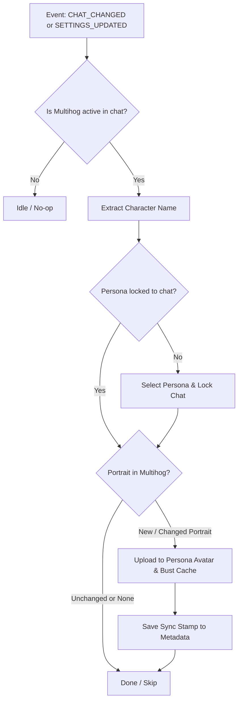

# MultiHog Companion for SillyTavern

A lightweight, non-destructive companion extension for the **[Multihog D&D Framework](https://github.com/MultihogAurelius/SillyTavern-MultihogDnDFramework)** in SillyTavern.

MultiHog Companion bridges the gap between Multihog's internal campaign state and SillyTavern's native Persona system without modifying Multihog's codebase directly.

---

## ✨ Features

### 1. 👤 Automatic Persona Binding (Persona Sync)
* **The Problem:** In Multihog, creating or activating a character often leaves the persona unbound from the chat session, causing SillyTavern to revert to your default persona when switching chats.
* **The Fix:** MultiHog Companion automatically detects the active player character in the campaign memo or partition, selects the matching persona, and locks it to the chat session (`/persona-lock on`).

### 2. 🎨 Automatic Portrait Sync
* **The Problem:** Multihog generates and manages character portraits in its own storage, but SillyTavern's user persona remains stuck with the default blank placeholder avatar.
* **The Fix:** Whenever Multihog generates or updates a character portrait (via character creation, AI Horde, or manual prompt rolls), MultiHog Companion pushes the portrait directly into the active SillyTavern Persona avatar file and busts the browser cache.

### 3. 📐 Smart Aspect-Ratio & Crop Bridge
* **The Problem:** When MultiHog triggers native image generation (portraits, NPCs, or location scenes), it invokes SillyTavern's `/imagine` command without specifying `width` or `height`. SillyTavern and ComfyUI fall back to global square resolutions (`512x512`). In MultiHog's UI, location scenes are rendered in 16:9 containers (`aspect-ratio: 16 / 9; object-fit: cover;`), slicing off character heads, hats, and skylines.
* **The VRAM-Safe Solution:** MultiHog Companion intercepts the `/imagine` command callback to detect MultiHog requests. When dimensions are omitted:
  * **Scenes:** Injects **`672 × 384`** (16:9 widescreen), perfectly matching the ~258k pixel budget of 512×512 (~262k px) so images generate in seconds without VRAM spillover.
  * **Portraits:** Injects **`512 × 512`** (1:1 square) to match MultiHog's 1:1 character avatar boxes.
* **CSS Safety Net:** Automatically anchors scene crops to `object-position: center 20% !important` to protect pre-existing square images or 3rd-party images from severed heads.

### 4. ⚡ Zero-Overhead & Change Detection
* Caches synchronization stamps in `chat_metadata`.
* Runs only when needed (on chat switch or when portrait content actually changes).
* No redundant file uploads, lag, or continuous polling loops.

### 5. 🎲 PbtA (Powered by the Apocalypse) Narrative Engine
* **2d6 Fiction-First Resolution:** Swaps D&D math (AC, BAB, initiative, HP bloat) for narrative 2d6 moves (10+ Strong Hit, 7–9 Weak Hit, 6- Miss / GM Move).
* **Zero-Touch Dice Mechanics:** You never roll dice manually! SillyTavern secretly feeds pre-rolled 2d6 dice from its `[RNG_QUEUE]` to the Ref (LLM) on demand.
* **Genre Stat Presets:** Built-in archetypes and attributes for **Fantasy**, **Sci-Fi / Cyberpunk**, **Anime / Shonen**, and **Modern / Horror**.
* **Quick Start Integration:** One-click character creation and campaign start via MultiHog's Instant Action pipeline.
* **One-Click Reversible:** Easily restore factory default D&D 5e settings anytime.
* 👉 **Full Documentation:** See **[PBTA.md](PBTA.md)** for detailed mechanics, stat arrays, and move lists.

---

## 📦 Requirements

* **[SillyTavern](https://github.com/SillyTavern/SillyTavern)** (v1.12.0 or newer recommended)
* **[SillyTavern-MultihogDnDFramework](https://github.com/MultihogAurelius/SillyTavern-MultihogDnDFramework)** installed and enabled

---

## 🚀 Installation

### Option 1: Via SillyTavern Extension Manager
1. Open SillyTavern.
2. Go to **Extensions** (Extensions icon in the top bar) -> **Install Extension**.
3. Paste the URL of this repository into the field and click **Install**.
4. Refresh SillyTavern.

### Option 2: Manual Clone
Clone this repository into your SillyTavern third-party extensions directory:

```bash
cd SillyTavern/public/scripts/extensions/third-party
git clone https://github.com/your-username/MultiHogCompanion.git
```

Restart or refresh SillyTavern.

---

## ⚙️ Settings & Configuration

Navigate to **Extensions Settings** in SillyTavern and expand the **MultiHog Companion** drawer:

| Setting | Default | Description |
| :--- | :--- | :--- |
| **Persona Sync** | `Enabled` | Automatically selects and locks the character persona to the current chat. |
| **Portrait Sync** | `Enabled` | Automatically pushes Multihog portraits into the SillyTavern persona avatar. |
| **Subtle Notifications** | `Enabled` | Shows short toast popups when synchronization occurs. |
| **Sync Current Chat Now** | Button | Manually triggers synchronization for the current chat on demand. |
| **Aspect-Ratio Bridge** | `Enabled` | Intercepts `/imagine` to dynamically assign 16:9 for scenes and 1:1 for portraits. |
| **Scene Resolution** | `672 × 384` | 16:9 widescreen resolution tuned to match the ~258k pixel budget of 512×512. |
| **Portrait Resolution** | `512 × 512` | 1:1 square resolution matching character avatar containers. |
| **Genre Preset** | `Fantasy` | Selects PbtA stats and moves for Fantasy, Sci-Fi, Anime, or Modern/Horror. |
| **Load PbtA Cartridge** | Button | Applies PbtA prompts and modules to MultiHog without starting a new character. |
| **⚡ Quick Start PbtA** | Button | Generates a PbtA character with genre stats, binds persona, and starts the adventure. |
| **Restore Stock D&D 5e** | Button | Restores MultiHog to factory D&D 5e prompts and systems. |

---

## ⌨️ Slash Commands

* `/mhc-sync` — Manually trigger persona and portrait synchronization for the active chat.
* `/mhc-pbta [genre]` — Load PbtA 2d6 ruleset into MultiHog (`fantasy`, `scifi`, `anime`, `horror`).
* `/mhc-dnd` — Revert MultiHog back to factory default D&D 5e ruleset.

---

## 🛠️ How It Works

MultiHog Companion is designed to be completely independent from Multihog's internal release cycle:



* **Loading Order:** Loads with `loading_order: 30` (after Multihog at `20`) so campaign state is ready.
* **Non-Destructive:** Does not edit Multihog files. Upstream Multihog updates will never break or conflict with this extension.

---

## 📄 License

MIT License. See [LICENSE](LICENSE) for details.
