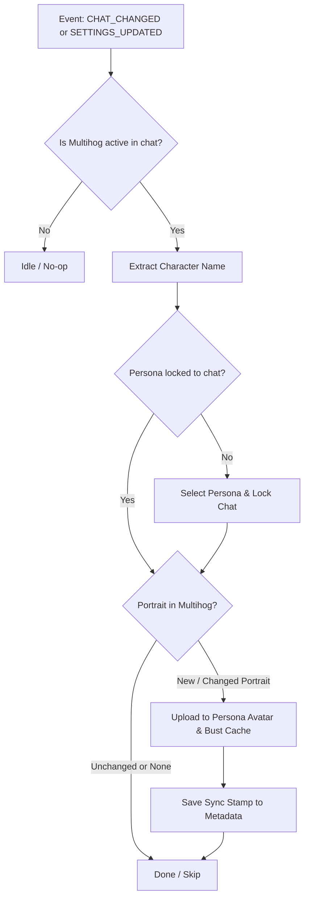

# MultiHog Companion for SillyTavern

A lightweight, non-destructive companion extension for the **[Multihog D&D Framework](https://github.com/MultihogAurelius/SillyTavern-MultihogDnDFramework)** in SillyTavern.

MultiHog Companion bridges the gap between Multihog's internal campaign state and SillyTavern's native Persona system without modifying Multihog's codebase directly.

---

## ✨ Features

### 1. 👤 Automatic Persona Binding (Persona Sync)
* **The Problem:** In Multihog, creating or activating a character often leaves the persona unbound from the chat session, causing SillyTavern to revert to your default persona when switching chats.
* **The Fix:** MultiHog Companion automatically detects the active player character in the campaign memo or partition, selects the matching persona, and locks it to the chat session (`/persona-lock on`).

### 2. 🎨 Automatic Portrait Sync
* **The Problem:** Multihog generates and manages character portraits in its own storage, but SillyTavern's user persona remains stuck with the default blank placeholder avatar.
* **The Fix:** Whenever Multihog generates or updates a character portrait (via character creation, AI Horde, or manual prompt rolls), MultiHog Companion pushes the portrait directly into the active SillyTavern Persona avatar file and busts the browser cache.

### 3. ⚡ Zero-Overhead & Change Detection
* Caches synchronization stamps in `chat_metadata`.
* Runs only when needed (on chat switch or when portrait content actually changes).
* No redundant file uploads, lag, or continuous polling loops.

### 4. 🔔 Subtle Toast Feedback
* Unobtrusive, short-duration notifications when a persona is locked or a portrait is updated (can be toggled off in settings).

---

## 📦 Requirements

* **[SillyTavern](https://github.com/SillyTavern/SillyTavern)** (v1.12.0 or newer recommended)
* **[SillyTavern-MultihogDnDFramework](https://github.com/MultihogAurelius/SillyTavern-MultihogDnDFramework)** installed and enabled

---

## 🚀 Installation

### Option 1: Via SillyTavern Extension Manager
1. Open SillyTavern.
2. Go to **Extensions** (Extensions icon in the top bar) -> **Install Extension**.
3. Paste the URL of this repository into the field and click **Install**.
4. Refresh SillyTavern.

### Option 2: Manual Clone
Clone this repository into your SillyTavern third-party extensions directory:

```bash
cd SillyTavern/public/scripts/extensions/third-party
git clone https://github.com/your-username/MultiHogCompanion.git
```

Restart or refresh SillyTavern.

---

## ⚙️ Settings & Configuration

Navigate to **Extensions Settings** in SillyTavern and expand the **MultiHog Companion** drawer:

| Setting | Default | Description |
| :--- | :--- | :--- |
| **Persona Sync** | `Enabled` | Automatically selects and locks the character persona to the current chat. |
| **Portrait Sync** | `Enabled` | Automatically pushes Multihog portraits into the SillyTavern persona avatar. |
| **Subtle Notifications** | `Enabled` | Shows short toast popups when synchronization occurs. |
| **Sync Current Chat Now** | Button | Manually triggers synchronization for the current chat on demand. |

---

## ⌨️ Slash Commands

* `/mhc-sync` — Manually trigger persona and portrait synchronization for the active chat.

---

## 🛠️ How It Works

MultiHog Companion is designed to be completely independent from Multihog's internal release cycle:



* **Loading Order:** Loads with `loading_order: 30` (after Multihog at `20`) so campaign state is ready.
* **Non-Destructive:** Does not edit Multihog files. Upstream Multihog updates will never break or conflict with this extension.

---

## 📄 License

MIT License. See [LICENSE](LICENSE) for details.
